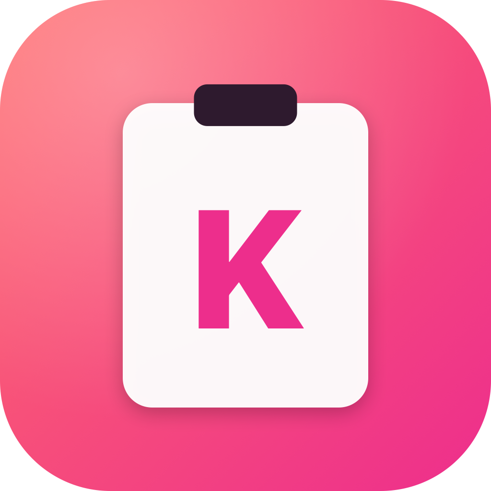

<div align="center">



# Kaste

**Native macOS clipboard manager, built in Swift.**
**原生 macOS 剪贴板管理器，使用 Swift 构建。**

A 1:1 open-source clone of Paste — summon your full clipboard history with **⇧⌘V**, browse a horizontal card panel that slides up from the bottom of the screen, and paste straight into the frontmost app.

对标 Paste 的开源复刻 —— 按 **⇧⌘V** 唤起完整剪贴板历史，屏幕底部弹出横向卡片面板，直接粘贴到当前 App。

</div>

---

## ✨ Features / 功能

### 📋 Capture everything / 全类型捕获
- **Text · Rich Text · Images · Files · URLs · Colors**
- Smart deduplication via SHA-256 — copying the same thing twice just bumps its timestamp.
- Original formatting preserved on paste (RTF, file references, multi-item pasteboards).
- 文本 / 富文本 / 图片 / 文件 / 链接 / 颜色 全部自动收纳，SHA-256 去重，粘贴时原样还原富格式。

### ⌨️ Keyboard-first / 键盘优先
| Shortcut / 快捷键 | Action / 操作 |
|---|---|
| `⇧⌘V` | Toggle the bottom panel / 唤起或关闭底部面板 |
| `⌥⇧⌘V` | Toggle in plain-text mode / 纯文本模式（剥离富格式） |
| `← →` | Navigate cards / 切换卡片 |
| `⏎` | Paste into the frontmost app / 粘贴到前台 App |
| `⌘1` … `⌘9` | Jump-paste the Nth item / 直接粘贴第 N 个 |
| `⌘P` | Pin / Unpin |
| `⌫` | Delete the selected item / 删除当前条目 |
| `esc` | Close / 关闭 |

### 🔍 Find it fast / 快速查找
- Instant full-text search across the entire history.
- Type filters: **All · Text · Image · Link · File · Color**.
- Pinned items stay at the front.
- 实时全文搜索 + 类型 tab 过滤 + Pin 置顶。

### 🧭 Menu bar companion / 菜单栏伴侣
- Lives in the menu bar with quick access to your last 10 clips.
- One-click paste, Preferences, Quit.
- 菜单栏常驻，一键粘贴最近 10 条。

### 🔒 Privacy by default / 默认隐私安全
- Honors `org.nspasteboard.ConcealedType` / `TransientType` / `AutoGeneratedType` — passwords from 1Password, Bitwarden, and friends are never captured.
- Excluded-app list for anything else you want kept out.
- All data stays on your Mac. No telemetry, no accounts, no cloud (sync via iCloud is on the roadmap and stays private to you).
- 自动忽略密码管理器；本地存储；不上报任何数据。

### ♾️ Built to stay out of your way / 不打扰
- Bottom-of-screen `NSPanel` that doesn't steal focus — when you press Enter the original app is still active and the paste lands where you'd expect.
- Auto-prunes after 1,000 items (configurable). Pinned items are never evicted.
- 底部悬浮面板不抢焦点；超 1000 条自动按最近使用淘汰，Pinned 永不删除。

---

## 🚀 Getting started / 快速开始

### Requirements / 环境要求
- macOS 15 (Sequoia) or later
- Xcode 16 or later (for building from source)

### Install from release DMG / 下载 DMG 安装

1. Grab the latest `Kaste-<version>-arm64.dmg` from [Releases](https://github.com/kastetools/kaste/releases).
2. Open the DMG and drag **Kaste** into **/Applications**.
3. **Remove the quarantine flag — required on every install/update**:

   ```bash
   xattr -dr com.apple.quarantine /Applications/Kaste.app
   ```

   Then double-click Kaste in /Applications. No more "unidentified developer" warning.

> **Why?** Kaste is currently ad-hoc signed and **not** notarized by Apple, so macOS Gatekeeper quarantines the download. Running `xattr` strips the flag once; you'll need to repeat it after every upgrade. Proper Developer ID signing + notarization is on the roadmap and will remove this step.
>
> **为什么?** 当前 Kaste 是 ad-hoc 签名、未走 Apple 公证,macOS Gatekeeper 会隔离下载文件。上面那条命令删掉隔离标记后双击就能直接打开,**每次升级覆盖 .app 后需要再跑一次**。后续会上 Developer ID 签名 + 公证,届时无需此步骤。


### Build & run / 构建运行

```bash
# 1. Clone the repo / 克隆仓库
git clone https://github.com/<your-name>/Kaste.git
cd Kaste

# 2. Generate the Xcode project / 生成 Xcode 工程
brew install xcodegen   # 已安装可跳过
xcodegen generate

# 3. Open in Xcode and hit ⌘R
open Kaste.xcodeproj
```

### First launch / 首次启动

1. Kaste runs as a **menu bar app** — no Dock icon.
   Kaste 以菜单栏模式运行，不占用 Dock。
2. macOS will ask for **Accessibility** permission. You must grant it for `⏎` to paste into the active app.
   首次会请求 **辅助功能** 权限，必须授权后才能用 `⏎` 自动粘贴。
   > System Settings → Privacy & Security → Accessibility → enable **Kaste**
   > 系统设置 → 隐私与安全性 → 辅助功能 → 勾选 **Kaste**
3. Copy something, then press **⇧⌘V**. Done.
   复制任意内容，按 **⇧⌘V**，搞定。

---

## 🎨 Logo

The Kaste logo is a coral-to-magenta gradient squircle with a white clipboard mark embossed with a bold "K". Regenerate at any time:

```bash
swift scripts/generate_icon.swift
```

Outputs all `AppIcon.appiconset` sizes plus a 1024 px `logo_1024.png` at the repo root.

LOGO 由脚本生成，珊瑚→品红渐变 + 白色剪贴板 + K 字。运行上面命令即可重新生成全部图标尺寸。

---

## 📂 Project layout / 项目结构

```
Kaste/
├── Kaste/                  Swift sources (app, core, features)
├── Kaste/Resources/        Assets.xcassets (icon, accent color)
├── scripts/                Icon generator
├── docs/                   Feature plan, architecture, roadmap
├── project.yml             XcodeGen config
└── README.md
```

Full feature plan, architecture notes, and roadmap live in the Vaptu Obsidian vault under `vaptu/10-projects/kaste/`.
完整功能清单、架构说明与里程碑放在 Vaptu Obsidian 库 `vaptu/10-projects/kaste/` 下。

---

## 📜 License

MIT.
